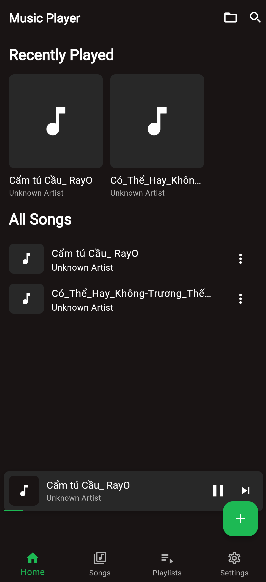
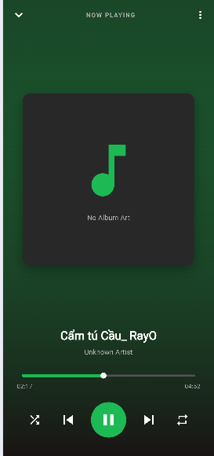
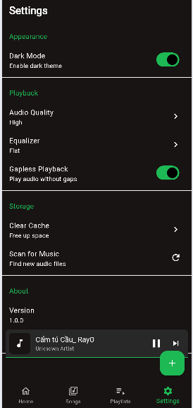
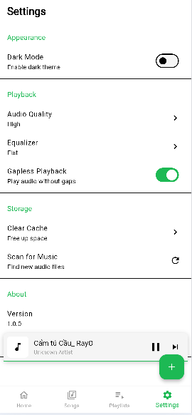

# 🎵 Music Player App

[](https://github.com/HuynhQuocHuyI/Music_player)

Music Player là một ứng dụng nghe nhạc được xây dựng bằng Flutter, mang đến trải nghiệm phát nhạc mượt mà, giao diện thân thiện và dễ sử dụng. Ứng dụng cho phép người dùng phát nhạc trực tiếp từ thiết bị, quản lý danh sách bài hát và thưởng thức âm nhạc mọi lúc, mọi nơi.

## ✨ Tính năng chính

- ▶️ Phát / tạm dừng / chuyển bài hát
- ⏭️ Chuyển bài tiếp theo & quay lại bài trước
- 🎶 Hiển thị thông tin bài hát (tên bài, nghệ sĩ, thời lượng)
- 📂 Phát nhạc từ bộ nhớ cục bộ của thiết bị
- 📜 Danh sách bài hát rõ ràng, dễ thao tác
- 🎧 Giao diện đơn giản, phù hợp cho người mới sử dụng
- 🔀 Phát ngẫu nhiên & lặp lại bài hát
- � Quản lý Playlist

## �🛠 Công nghệ sử dụng

- **Flutter & Dart**
- **just_audio** - Phát nhạc
- **provider** - Quản lý state
- **file_picker** - Chọn file nhạc
- **shared_preferences** - Lưu trữ cài đặt

## 📱 Hỗ trợ nền tảng

- ✅ Android
- ✅ Windows
- ✅ iOS (có thể mở rộng)

## 🚀 Cài đặt

```bash
git clone https://github.com/HuynhQuocHuyI/Music_player.git
cd Music_player
flutter pub get
flutter run
```

## 📸 Screenshots

### Giao diện vào app: Gồm danh sách bài hát


### Thêm Playlists để bỏ những bài nhạc yêu thích vào


### Giao diện bài hát đầy đủ các yếu tố cơ bản


#### Sting tối và sáng:
 

## 👨‍💻 Tác giả

**Huỳnh Quốc Huy I**

- GitHub: [@HuynhQuocHuyI](https://github.com/HuynhQuocHuyI)

## 📄 License

This project is open source and available under the [MIT License](LICENSE).